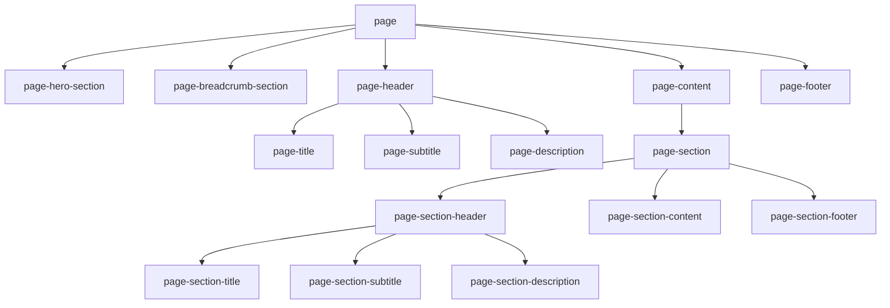

# Page Structure

| Component / Directive      | Purpose / Function                                                    | Styling Notes                                 |
| -------------------------- | --------------------------------------------------------------------- | --------------------------------------------- |
| `page`                     | Main wrapper for the entire page                                      | Responsive container with consistent padding  |
| `page-hero-section`        | Top visual/hero area, often used for banners or highlights (optional) | Large responsive padding for hero areas       |
| `page-breadcrumb-section`  | Section for breadcrumbs (optional)                                    | Minimal padding for navigation                |
| `page-header`              | Container for title, subtitle, and description (optional)             | Medium spacing with bottom margin             |
| `page-title`               | Main title of the page (h1)                                           | Large responsive title with bold weight       |
| `page-subtitle`            | Subtitle under the main title (h2)                                    | Bordered subtitle with semibold weight        |
| `page-description`         | Short introduction or summary text                                    | Large muted text                              |
| `page-content`             | Main content wrapper for all sections                                 | Larger spacing between major content sections |
| `page-footer`              | Footer specific to this page (not global)                             | Separated with top border                     |
| `page-section`             | Individual content block inside page-content                          | Medium spacing within sections                |
| `page-section-header`      | Section-specific header (subtitle + description)                      | Tight spacing for header elements             |
| `page-section-title`       | Title for a section (h3)                                              | Section heading with semibold weight          |
| `page-section-subtitle`    | Subtitle for a section (h4)                                           | Subsection heading with semibold weight       |
| `page-section-description` | Supporting description for a section                                  | Muted section description                     |
| `page-section-content`     | Actual content inside the section                                     | Standard content spacing                      |
| `page-section-footer`      | Footer specific to the section                                        | Small separated footer                        |
